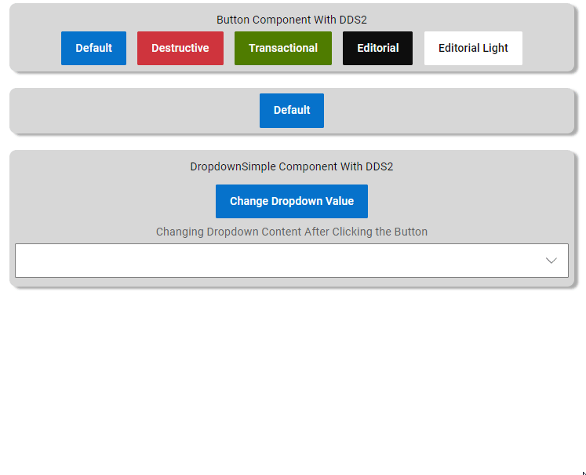

# Ramp-up Angular - Módulo 2

Bem-vindo ao ramp-up em Angular!

# Módulo 2

Agora iremos realizar o compartilhamento de dados, renderização condicional e criação de evento para os componentes criados no modulo 1.

# Objetivo

- Crie um evento no componente de botão para que mostre/esconda um paragrafo com uma mensagem.
- Realize o compartilhamento de dados entre componentes pai e filho para que possa mudar o texto e classe do botão.
- Após realizar o compartilhamento, faça um botão para cada cor padrão do DDS2, Default, Destructive, Transactional, Editorial e Editorial Light
- No componente de Dropdown, faça com que não possua itens listados, após clicar em um botão, seja carregada uma lista para este Dropdown.
- Apresenta-los na tela inicial da aplicação.

## Exemplo

# Apresentação de resultados

Faça um pull request para atualizar seus resultados em /docs/<nome.usuario>/ramp-up/